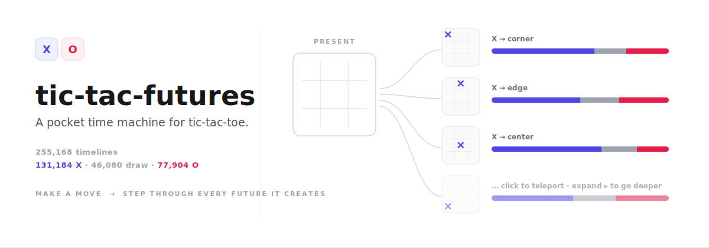
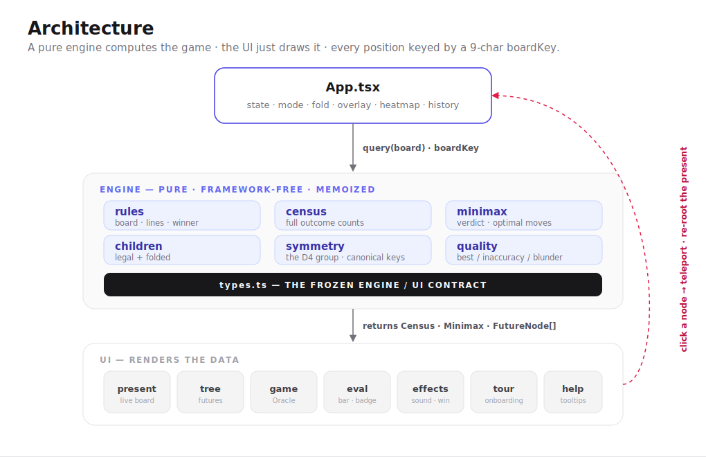

<p align="center">
  
</p>

<p align="center">
  <em>A pocket time machine for tic-tac-toe. Make a move, then step <strong>forward</strong> through every timeline it creates — branching, counted, and explorable in real time.</em>
</p>

<p align="center">
  
  
  
  
  
  
</p>

<p align="center">
  <a href="#-a-little-combinatorics">Combinatorics</a> ·
  <a href="#-bending-time">Bending time</a> ·
  <a href="#whats-inside">What's inside</a> ·
  <a href="#run-it-locally">Run it</a> ·
  <a href="#how-its-built">How it's built</a>
</p>

---

A fun side project that treats the world's simplest game as a tiny **block universe**.
The present board is your *now*; the **futures tree** is the multiverse of everything that
could happen next. Click any branch to **teleport** your now into that timeline and watch
the future re-grow around you.

## 🎲 A little combinatorics

From the empty board there are `9!` = **362,880** ways to *order* nine moves — but games end
the instant someone gets three in a row, and not every ordering is legal. Prune those and you
are left with exactly:

```
255,168 complete games
├── 131,184   X wins   ▏ 51.4%
├──  46,080   draws    ▏ 18.1%
└──  77,904   O wins   ▏ 30.5%
```

This app enumerates that space lazily, one branch at a time, and shows you the **census** —
how many of those 255,168 timelines flow through the node you are looking at. The counts roll
up the tree live as you expand it.

A nice fact falls out of the square's symmetry: the 9 opening squares are really only **3**
moves in disguise — a corner, an edge, the center — because the square has 8 symmetries (the
dihedral group **D₄**: four rotations × two reflections). Flip **Fold symmetries** and
mirror-image timelines collapse into one (corner ×4, edge ×4, center ×1).

## ⏳ Bending time

- **Teleport** — click any node in the tree and the present board jumps to that position. Your
  *now* is just a bookmark in the block universe; move it freely.
- **Census vs. prophecy** — raw outcome tallies by default; toggle the **minimax overlay** to
  light up the theoretically optimal moves and the game-theoretic verdict (what *will* happen if
  both sides play perfectly from here).
- **Beat the Oracle** — face an opponent who has *already seen every future*. Spoiler from said
  future: against perfect play, the best you can force is a draw.

<h2 id="whats-inside">🧩 What's inside</h2>

| Mode / toggle | What it does |
| :-- | :-- |
| 🧭 **Explore** | Auto-alternating play — wander the futures with no opponent. |
| ♟️ **Beat the Oracle** | You're X against perfect minimax play (or random, for a fair fight). Every move is graded **best / inaccuracy / blunder**, with a best-move streak counter. |
| 📊 **Minimax overlay** | Highlights optimal moves and the game-theoretic verdict for the position. |
| 🔁 **Fold symmetries** | Merges D₄-equivalent branches — the 9 openings collapse to 3. |
| 🌡️ **Fate heatmap** | Tints every move by which side destiny favors. |
| 🔊 **Sound + effects** | Move/win cues, a self-drawing win line, a small celebration — all stand down under `prefers-reduced-motion`. |
| 🧭 **Onboarding** | A first-visit spotlight tour, inline ⓘ tooltips, and a "How it works" legend. |

## Run it locally

This project uses **[Bun](https://bun.sh)**.

```bash
bun install      # install dependencies
bun run dev      # dev server → http://localhost:5173
bun run test     # full test suite (103 tests)
bun run typecheck
bun run build    # type-check + production build
bun run preview  # preview the production build
```

> npm / Node work too, but `bun` is the reliable path in this environment.

<h2 id="how-its-built">🏗️ How it's built</h2>

<p align="center">
  
</p>

A pure, framework-free **engine** computes everything about the game; a **UI** layer just draws
it. They're separated by a frozen type contract so each side can evolve alone. Every position is
keyed by a 9-character `boardKey`, so census and minimax results are memoized and shared across
the whole tree — the multiverse is cheap to recount.

<details>
<summary><strong>Project structure</strong></summary>

```
src/
├── engine/                 # pure game logic, all memoized by a 9-char boardKey
│   ├── types.ts            # FROZEN contract: Board, Census, Minimax, FutureNode, …
│   ├── rules.ts            # board basics, LINES, winner, boardKey
│   ├── census.ts           # full outcome counts for any position
│   ├── minimax.ts          # game-theoretic verdict + optimal moves
│   ├── children.ts         # children() and foldedChildren() (symmetry-grouped)
│   ├── symmetry.ts         # the D₄ group, canonicalize, canonical keys
│   ├── quality.ts          # classifyMove (best/inaccuracy/blunder), positionLean
│   └── index.ts            # re-exports + compile-time Engine contract guard
├── ui/
│   ├── present/            # the live board, controls, verdict, legend
│   ├── tree/               # FuturesTree + self-animating TreeNode / NodeCard
│   ├── game/               # mode switch, the Oracle opponent, move analysis, streak
│   ├── eval/               # eval bar + move-quality badge
│   ├── effects/            # sound, win-line, celebration
│   ├── tour/               # first-run spotlight tour
│   ├── help/               # info tooltips + legend copy
│   └── shared/             # mini-board, census bar, rolling numbers
├── styles/global.css       # design tokens (semantic palette, spacing, motion)
└── App.tsx                 # shell / state orchestration
```

</details>

<details>
<summary><strong>Two invariants worth keeping</strong></summary>

- **Nodes self-animate** to a visible end state with explicit `initial`/`animate`; visibility is
  never delegated to parent→child variant propagation through `AnimatePresence`.
- The root child list is a plain `<ul key={rootKey}>` that **remounts cleanly on re-root**.

Both exist because violating them made tree nodes vanish — twice. Don't reintroduce the bug.

</details>

## Verified anchors

- `census(empty)` = **255,168** total · 131,184 X / 46,080 draw / 77,904 O
- `minimax(empty)` = **DRAW** — perfect play is always a tie, the oldest spoiler in gaming
- A corner opening folds O's 8 replies down to **5** distinct classes under D₄

---

<p align="center"><sub>Built for fun. Tic-tac-toe was solved decades ago; this just lets you walk around inside the solution.</sub></p>
